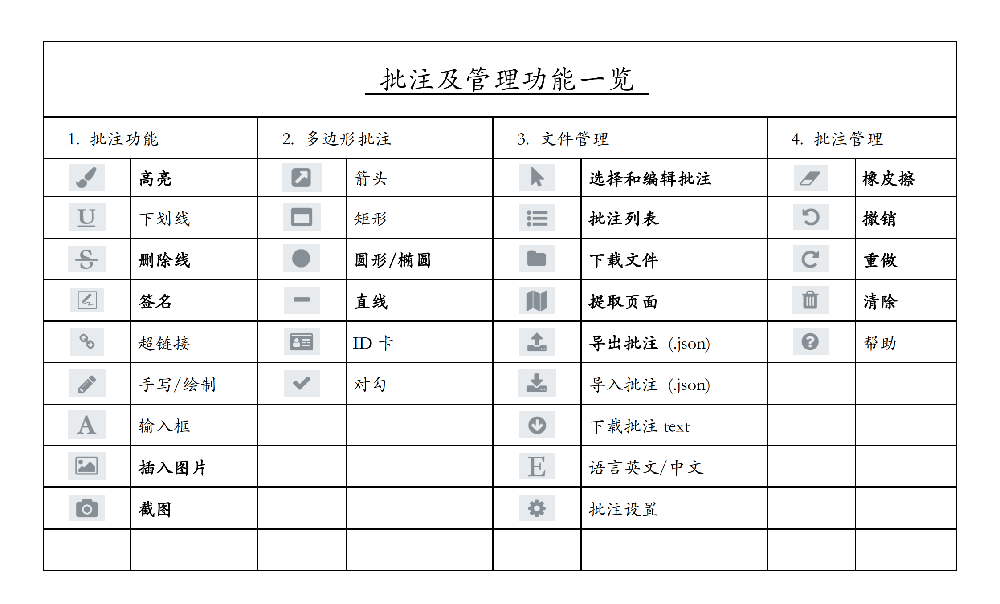

<h1 align="center">ElasticPDF-简如 pdf.js，强如 Acrobat</h1>

<h4 align="center" style='margin-bottom:30px;'>
    <a href="#">English</a> · 
	<a href="#">简体中文</a> ·
    <a href="https://www.elasticpdf.com/documentation">文档</a> · 
	<a href="https://github.com/ElasticPDF/elasticpdf/issues/new?assignees=&labels=&projects=&template=bug_report.yml" target="_blank">Report Bug</a> · 
	<a href="https://github.com/ElasticPDF/elasticpdf/issues/new?assignees=&labels=%3Asparkles%3A+feature+request&projects=&template=feature_request.yml" target="_blank">Request Feature</a> · 
	<a href="https://github.com/ElasticPDF/elasticpdf/discussions" target="_blank">FAQ</a>
</h4>

  
  
  
  
  
  

	
	
	
	
	
  
  
  
  

ElasticPDF 是一款**新国产 PDF 编辑器开发框架**，基于开源 pdf.js 的渲染框架，增加了批注功能，支持全离线运行，适用于公网及内网系统。代码包结构延续了 pdf.js-dist 简洁的风格，兼容所有主流浏览器，不仅可以部署于 Web 项目，也可以嵌入任意桌面端和移动端项目中。                              
                                    

## 0 安装部署
购买许可后我们会提供一个开箱即用的离线代码包，安装部署方法与 **pdf.js-dist** 代码包相同，具体方法为使用 `<iframe>` 或者 `<webview>` 等组件导入代码包内的 viewer.html 即完成嵌入，无需下载任何依赖。
         

## 1 在线 Demo 地址

针对于不同项目的开发需求，目前有两个版本的产品可供选择（非免费） ，两者在授权方式和最终批注写入 PDF 的技术效果上有区别，具体以在线 Demo 网站的说明和运行效果为准。试用过程中如遇问题请 <a href="https://github.com/ElasticPDF/elasticpdf/issues/new?assignees=&labels=&projects=&template=bug_report.yml" style='font-weight:600;text-decoration:underline;' target="_blank">Report Bug</a>            

**① 批注合成版：<https://demos.libertynlp.com/#/pdfjs-annotation>**

**② 标准批注版：<https://www.elasticpdf.com/demo>**

			                    
## 2 功能展示

除以下功能外，其他功能也在持续开发中，几乎所有功能都支持定制开发，欢迎提交
<a style='font-weight:700;text-decoration:underline;' href="https://github.com/ElasticPDF/elasticpdf/issues/new?assignees=&labels=%3Asparkles%3A+feature+request&projects=&template=feature_request.yml" target="_blank">功能需求</a>

## 3 技术优势

ElasticPDF 延续了 pdf.js-dist 的架构风格，全部使用朴素 Javascript 代码开发，简单来说 是在 pdf.js-dist 代码包中增加了几个 js 文件，无需任何在线依赖即可运行， 因而非常适合作为功能模块整合到其他项目中。

不仅可以部署于公网环境应用，独立、简洁的特点也让其拥有完全透明和可控的安全性，因而被选择**部署于众多内网系统**中。

经过多年的研发，**即使是只依赖 HTML，CSS 和 Javascript 运行的产品，批注等功能的产品力也已接近世界一流的PDF编辑器（比如 Adobe Acrobat）**，具体为批注可以以标准格式写入pdf中，包括注释的任意语言的文字，之后可以再在其他编辑器中编辑。

另外还可以将 **批注独立导出为 JSON** 格式，便于入库和重载回显，在云端协同的系统中非常便利和经济，因为只需要一个在线原文档和保存数量级通常不到 1M 的批注文件，而不再需要把批注合并到文档中一起保存到后端数据库，可以节省很多流量、宽带和储存费用。

## 4 批注功能演示

① 文本高亮

无论是桌面端、平板端或者手机都可以精确选择文本，支持跨页高亮，高亮后内容可以修改颜色等属性。

② 下划线

与高亮功能类似，实现了多种设备文本的精确选择，批注生成后可以修改批注颜色、线条粗细等
<video autoplay loop src="https://github.com/user-attachments/assets/4a338de0-aa36-4d27-91ea-1304d8bfee72"></video>

③ 插入图片

支持以选取文件或者拖入的方式来插入图片，之后可以对图片的大小、位置、方位、不透明度等实现流畅的修改
<video autoplay loop src="https://github.com/user-attachments/assets/bdd211b7-eb19-4bc4-9ab9-54788be45a8b"></video>

④ 屏幕截图

绘制矩形框后可截取当前文档的部分内容，并可以修改矩形框位置后再次截图
<video src="https://github.com/user-attachments/assets/13a1fb58-fa06-42d5-a98c-0cc82a1eef87"></video>

⑤ 自由绘制

可以随意调整笔刷的大小、颜色和不透明度，然后在文档上自由的绘制，在设置不透明度较小时还可以用来高亮扫描件文本
<video src="https://github.com/user-attachments/assets/b7569b1c-92a4-47ae-b6f5-42c4e5b96028"></video>

⑥ 添加文本

可以以插入和拖入的方式来创建文本批注，支持所有语言，创建后可以拖动的方式修改字体形状、字体大小等
<video src="https://github.com/user-attachments/assets/13def84d-0f45-492e-9dba-d6886cd9e430"></video>

⑦ 多边形

支持创建箭头、直线、矩形、圆形（椭圆）、对勾和身份印章等多边形，生成后的批注支持颜色、大小、位置方位等的修改
<video src="https://github.com/user-attachments/assets/d43baf08-e8a7-48fa-ba83-133649cc4dbb"></video>

⑧ 超链接

通过绘制矩形框或者选取文字后创建超链接对象，之后可以链接到 URL、页码、在线文档等
<video src="https://github.com/user-attachments/assets/140acbae-a747-4d8c-8af6-257aff8a273e"></video>

## 3.2 批注管理功能

① 橡皮擦

超强橡皮擦功能，可以局部擦除批注对象，擦除过程中轨迹可见，且擦除后的文本仍然可编辑
<video src="https://github.com/user-attachments/assets/2350143a-9e74-4249-ab00-822a36e840e3"></video>

② 撤销 & 重做 批注

撤销或者重做批注，包括批注的生成、修改等各类编辑以及删除等操作
<video src="https://github.com/user-attachments/assets/d49a30ee-0802-42e5-b66b-73bba25558ea"></video>

③ 导出 & 导入 JSON 批注

支持将批注文档导出为 JSON 文件，之后再次加载 JSON 文件实现完美的回显，是多端同步的最佳方案
<video src="https://github.com/user-attachments/assets/329e3295-e4b5-4cc4-9e22-d12f29990135"></video>

④ 批注连接线 & 双语

将右侧列表中的批注与页面的图形对象相连，每一页都单独控制；所有页面操作都支持中英文双语
<video src="https://github.com/user-attachments/assets/8c490a7c-ea4d-499b-93db-b89834c70160"></video>
