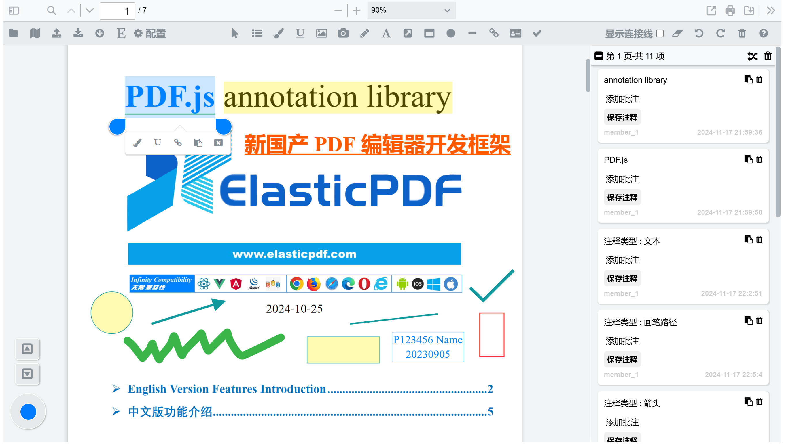
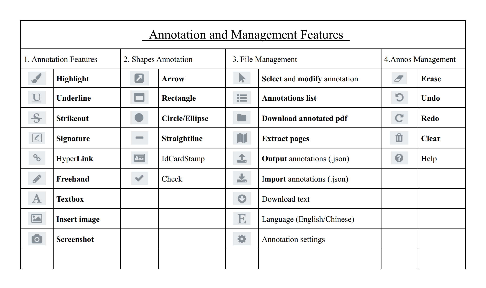

<h1 align="center">ElasticPDF-Simple as pdf.js, Powerful as Acrobat</h1>

<h4 align="center" style='margin-bottom:30px;'>
    English · 
    <a href="./README-CN.md">简体中文</a> ·  
    <a href="https://www.elasticpdf.com/contact">Contact</a> · 
    <a href="https://www.elasticpdf.com/documentation">Doc</a> · 
	<a href="https://github.com/ElasticPDF/elasticpdf/issues/new?assignees=&labels=&projects=&template=bug_report.yml" target="_blank">Report Bug</a> · 
	<a href="https://github.com/ElasticPDF/elasticpdf/issues/new?assignees=&labels=%3Asparkles%3A+feature+request&projects=&template=feature_request.yml" target="_blank">Request Feature</a> · 
	<a href="https://github.com/ElasticPDF/elasticpdf/discussions" target="_blank">FAQ</a>
</h4>

  
  
  
  
  
  

	
	
	
	
	
  
  
  
  

ElasticPDF is a **new professional PDF editor development library**, based on the open source pdf.js-dist, with added annotation features, supporting full offline deploy, and suitable for public and intranet systems. The code structure continues the simple style of pdf.js-dist, is compatible with all mainstream browsers, and can be deployed not only in Web projects, but also embedded in any desktop and mobile projects.
 
## 0 Usage
After purchasing a license, we will provide a **out-of-the-box** offline code package. The installation and deployment method is the same as the **pdf.js-dist** code package. The specific method is to use components such as **`<iframe>`** or **`<webview>`** to import the _**`viewer.html`**_ in the code package to complete the embedding without downloading any dependencies.

## 1 Live Demo

There are currently two versions of the product available for selection (not free) to meet the development needs of different projects. The two versions differ in the authorization method and the technical effect of the final annotation writing into PDF. The specific instructions and operation effects of the online Demo website shall prevail. Any bugs in usage please <a href="https://github.com/ElasticPDF/elasticpdf/issues/new?assignees=&labels=&projects=&template=bug_report.yml" style='font-weight:600;text-decoration:underline;' target="_blank">Report Bug</a>            

**① Annotation synthesis version: <https://demos.libertynlp.com/#/pdfjs-annotation>**

**② Standard annotation version: <https://www.elasticpdf.com/demo>**

			                    
## 2 Features Introduction

In addition to the following features, others are also under continuous development, and features can be customized. Any wanted feature feel free to submit
<a style='font-weight:700;text-decoration:underline;' href="https://github.com/ElasticPDF/elasticpdf/issues/new?assignees=&labels=%3Asparkles%3A+feature+request&projects=&template=feature_request.yml" target="_blank">Request Feature</a>

## 3 Technical advantages

ElasticPDF continues the architectural style of pdf.js-dist, and is developed entirely with simple Javascript code. In short, it adds several js files to the pdf.js-dist code package, and can run without any online dependencies, so it is very suitable for integration into other projects as a functional module.

It not only can it be deployed in public network environment applications, but its independent and simple features also give it completely transparent and controllable security, so it is chosen to be **deployed in many intranet systems**.

After years of research and development, **even if it is a product that only relies on HTML, CSS and Javascript to run, the product power of annotation and other features is close to that of world-class PDF editors (such as Adobe Acrobat)**. Specifically, annotations can be written into PDF in a standard format, including text in any language of the annotation comment, and can be edited in other editors later.

In addition, **annotations can be exported independently in JSON** format, which is convenient for storage and reload echo. It is very convenient and economical in cloud-based collaborative systems, because only an online original document and an annotation file with a size of usually less than 1M are required, and there is no need to merge the annotations into the document and save them together in the back-end database, which can save a lot of traffic, broadband and storage costs.

## 4 Features Demo Videos

### 4.1 Annotation Features
① Text highlighting

Whether it is desktop, tablet or mobile phone, you can accurately select text, support cross-page highlighting, color and other attributes of the highlighted content can be modified.
<video autoplay loop src="https://github.com/user-attachments/assets/12b2c07d-0fed-4693-90bb-eda65ce184dd"></video>

② Underline

Similar to the highlight, it realizes the precise selection of texts on multiple devices. After the annotation generated, the annotation color, line thickness, etc. can be modified
<video autoplay loop src="https://github.com/user-attachments/assets/4a338de0-aa36-4d27-91ea-1304d8bfee72"></video>

③ Insert image

Supports inserting images by selecting files or dragging them in, and then the size, position, orientation, opacity, etc. of the image can be smoothly modified
<video autoplay loop src="https://github.com/user-attachments/assets/bdd211b7-eb19-4bc4-9ab9-54788be45a8b"></video>

④ Screenshot

After drawing a rectangle, you can capture part of the current document, you can modify the position of the rectangle and take another screenshot
<video src="https://github.com/user-attachments/assets/13a1fb58-fa06-42d5-a98c-0cc82a1eef87"></video>

⑤ Brush Free drawing

You can freely adjust the size, color and opacity of the brush, and then freely draw on the document. When the opacity is set to a small value, it can also be used to highlight the text in the scanned document
<video src="https://github.com/user-attachments/assets/b7569b1c-92a4-47ae-b6f5-42c4e5b96028"></video>

⑥ Add text

You can create text annotations by inserting and dragging, supporting all languages. After creation, you can modify the font shape, font size, etc. by dragging
<video src="https://github.com/user-attachments/assets/13def84d-0f45-492e-9dba-d6886cd9e430"></video>

⑦ Polygon

Supports the creation of polygons such as arrows, lines, rectangles, circles (ellipse), check marks and identity stamps. The generated annotations support the modification of color, size, position and orientation, etc.
<video src="https://github.com/user-attachments/assets/d43baf08-e8a7-48fa-ba83-133649cc4dbb"></video>

⑧ Hyperlink

Create a hyperlink object by drawing a rectangular box or selecting text, and then you can link to a URL, page number, online document, etc.
<video src="https://github.com/user-attachments/assets/140acbae-a747-4d8c-8af6-257aff8a273e"></video>

### 4.2 Annotation Management Features

① Eraser

The powerful eraser can partially erase the annotation object. The track is visible during the erasing process, and the erased text is still editable
<video src="https://github.com/user-attachments/assets/2350143a-9e74-4249-ab00-822a36e840e3"></video>

② Undo & Redo Annotation

Undo or redo annotations, including annotation generation, modification, and other editing and deletion operations
<video src="https://github.com/user-attachments/assets/d49a30ee-0802-42e5-b66b-73bba25558ea"></video>

③ Export & Import JSON Annotation

Supports exporting annotation as JSON files, and then reloading JSON files to achieve perfect echo, which is the best solution for multi-terminal synchronization
<video src="https://github.com/user-attachments/assets/329e3295-e4b5-4cc4-9e22-d12f29990135"></video>

④ Annotation Connection Line & Bilingual

Connect the annotations in the list on the right to the graphic objects on the page, and control each page separately; all page operations support Chinese and English
<video src="https://github.com/user-attachments/assets/8c490a7c-ea4d-499b-93db-b89834c70160"></video>
